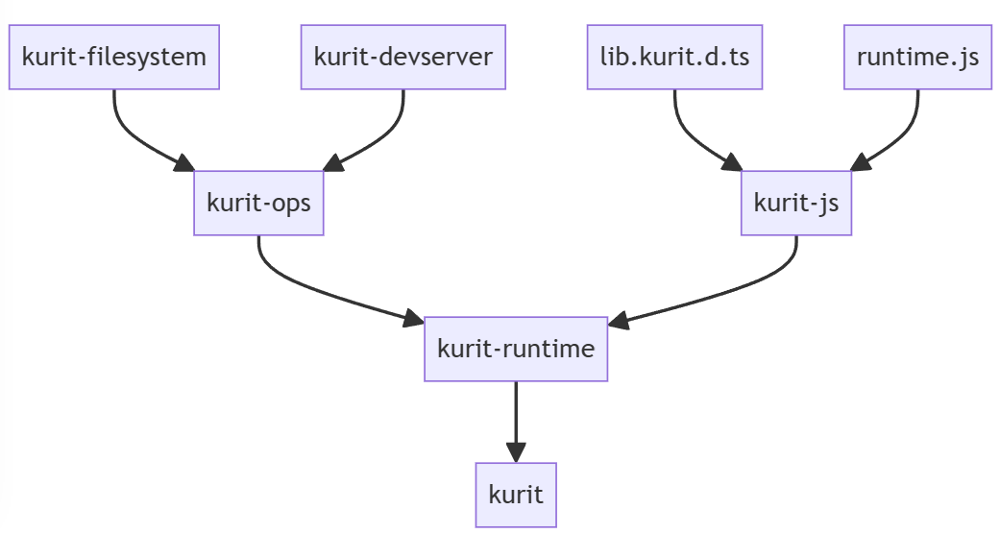

# Kurit
<div align="center">
  
  <h3>Static website generator 🚀</h3>
</div>

> **WIP**: It is still under development, so some of the features may not be developed.

## Project Structures
<div align="center">
  
</div>

## Clone
```sh
~/$ git clone --recursive https://github.com/AkiaCode/kurit && cd ./kurit
```

## Build
```sh
~/kurit$ cargo run --release -- build ./tests/profile.md
   Compiling kurit-ops v0.1.0 (/Volumes/Seritka/github/kurit/crates/kurit-ops)
   Compiling kurit-runtime v0.1.0 (/Volumes/Seritka/github/kurit/crates/kurit-runtime)
   Compiling kurit v0.1.0 (/Volumes/Seritka/github/kurit/crates/kurit)
    Finished release [optimized] target(s) in 9.78s
     Running `target/release/kurit build ./tests/profile.md`
Finish...🚀
```

## Serve
```sh
~/kurit$ cargo run --release -- serve ./tests/profile.html
   Compiling kurit-js v0.1.0 (/Volumes/Seritka/github/kurit/crates/kurit-js)
   Compiling kurit-runtime v0.1.0 (/Volumes/Seritka/github/kurit/crates/kurit-runtime)
   Compiling kurit v0.1.0 (/Volumes/Seritka/github/kurit/crates/kurit)
    Finished release [optimized] target(s) in 8.77s
     Running `target/release/kurit serve ./tests/profile.html`
[kurit-log]: Serving ./tests/profile.html at http://localhost:4101/profile.html
```

## Run
```sh
~/kurit$ cargo run --release
```
## Features (not yet)

### Single executable
```sh
~/kurit$ ldd ./target/debug/kurit
	linux-vdso.so.1 (0x00007ffddadfe000)
	libgcc_s.so.1 => /lib/x86_64-linux-gnu/libgcc_s.so.1 (0x00007fe2123e0000)
	libm.so.6 => /lib/x86_64-linux-gnu/libm.so.6 (0x00007fe2122f9000)
	libc.so.6 => /lib/x86_64-linux-gnu/libc.so.6 (0x00007fe212000000)
	/lib64/ld-linux-x86-64.so.2 (0x00007fe2146df000)
```

### Small File
```sh
~/kurit$ cargo bloat --release --crates -n 10
   Compiling kurit-ops v0.1.0 (/Volumes/Seritka/github/kurit/crates/kurit-ops)
   Compiling kurit-runtime v0.1.0 (/Volumes/Seritka/github/kurit/crates/kurit-runtime)
   Compiling kurit v0.1.0 (/Volumes/Seritka/github/kurit/crates/kurit)
    Finished release [optimized] target(s) in 15.91s
    Analyzing target/release/kurit

 File  .text    Size Crate
56.3% 100.1% 17.0MiB [Unknown]
56.3% 100.0% 17.0MiB .text section size, the file size is 30.2MiB

Note: numbers above are a result of guesswork. They are not 100% correct and never will be.
```

### Zero-config
